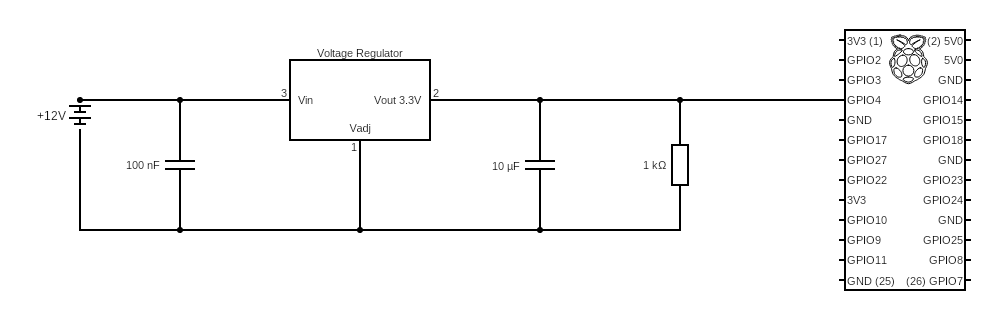

# NanoDriverAssist

## Drive line circuit diagram

## Misc notes

OPENBLAS_CORETYPE=AARCH64 python3 simple_camera.py

[comment]: # (todo setup the entrypoint with the above env variable, and fix the
openCV version to be able to actually get the camera feed working.)
